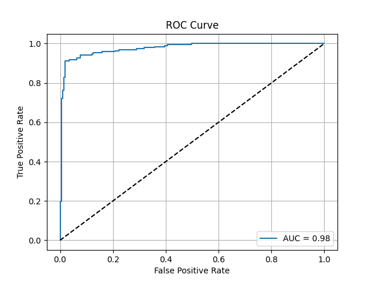

# Custom Transformer for Movie Review Sentiment Analysis

This project implements a custom Transformer Encoder model built with PyTorch to perform binary sentiment analysis (Positive/Negative) on movie reviews. The model leverages pre-trained BERT embeddings and is served through an interactive web interface created with Streamlit.

[](https://www.python.org/downloads/)
[](https://opensource.org/licenses/MIT)
[](https://your-streamlit-app-url.com) <!-- Replace with your deployment URL -->

---

## 🎬 Live Demo

This repository includes a Streamlit application for real-time sentiment analysis. You can enter any movie review to see the model's prediction and confidence score.


*(Note: This is a sample GIF. You can create your own to showcase the app.)*

---

## ✨ Features

- **Custom Transformer Encoder:** A from-scratch implementation of a Transformer Encoder block, including Multi-Head Self-Attention and a Position-wise Feed-Forward Layer.
- **BERT Embeddings:** Utilizes the powerful contextual embeddings from `bert-base-uncased` as input to the custom encoder.
- **Training & Evaluation:** Includes complete scripts for training the model and evaluating its performance.
- **Performance Visualization:** A Jupyter Notebook to generate and save key performance metrics like the Confusion Matrix, Precision-Recall Curve, and ROC Curve.
- **Interactive UI:** A user-friendly web interface built with Streamlit for easy interaction and testing.

---

## 📈 Model Performance

The model was evaluated on a 20% hold-out test set from the movie review dataset. The performance metrics below illustrate its effectiveness in classifying sentiment.

| Confusion Matrix | Precision-Recall Curve | ROC Curve |
| :---: | :---: | :---: |
|  |  |  |

---

## 🛠️ Model Architecture

The sentiment analysis pipeline follows these steps:

1.  **Input Text**: A movie review is passed as input.
2.  **BERT Encoder**: The text is tokenized and passed through a pre-trained `bert-base-uncased` model to generate contextual word embeddings. The `last_hidden_state` (shape: `[batch_size, sequence_length, 768]`) is used as the input for our custom model.
3.  **Custom Transformer Encoder**: This `last_hidden_state` is then processed by a stack of custom `EncoderBlock` layers. Each block performs multi-head self-attention to refine the representations.
4.  **Pooling**: The output from the final encoder block is averaged across the sequence length dimension (Mean Pooling) to produce a single vector representation for the entire review.
5.  **Classification Head**: A final linear layer maps the pooled vector to a single logit for binary classification.
6.  **Sigmoid Activation**: The logit is passed through a sigmoid function to get a probability score between 0 and 1.

**Key Parameters:**
- `d_model`: 768 (to match BERT's output)
- `num_heads`: 4
- `num_layers`: 2
- `dropout_rate`: 0.1

---

## 📂 Project Structure

```
.
├── CustomDataset.py            # PyTorch Dataset class for loading data
├── CustomModel.py              # Defines the custom Transformer Encoder model
├── dataset_download.py         # Script to download the dataset from Kaggle
├── environment.yml             # Conda environment definition
├── interface.py                # The Streamlit web application
├── metrics_and_visualization.ipynb # Notebook to generate performance plots
├── model_state_dict.pt         # Saved model weights (generated after training)
├── README.md                   # This file
├── train.py                    # Main script for training the model
├── utils.py                    # Helper functions for training, testing, and inference
└── visualizations/
    ├── ConfusionMatrix.png     
    ├── PRCurve.png             
    └── ROCCurve.png            
```

---

## ⚙️ Setup and Installation

Follow these steps to set up the project environment using Conda.

**1. Clone the Repository**
```bash
git clone https://github.com/Spicyredd/Sentiment_Classifier_From_Scratch
cd Sentiment_Classifier_From_Scratch
```

**2. Create and Activate the Conda Environment**
This command creates a new Conda environment named `sentiment-transformer` and installs all dependencies listed in the `environment.yml` file.

```bash
conda env create -f environment.yml
```
This process may take a few minutes. Once it's complete, activate the new environment:
```bash
conda activate sentiment-transformer
```

**3. Configure Kaggle API**
To download the dataset, you need to have your Kaggle API credentials set up.
1.  Go to your Kaggle account settings page.
2.  Click on "Create New Token" to download `kaggle.json`.
3.  Place the `kaggle.json` file in the appropriate location (e.g., `~/.kaggle/` on Linux/macOS or `C:\Users\<Your-Username>\.kaggle\` on Windows).

---

## 🚀 Usage

**Step 1: Download the Dataset**
Run the download script. This will download the dataset into the root directory.
```bash
python dataset_download.py
```

**Step 2: Train the Model**
Execute the training script. This will train the model and save the weights as `model_state_dict.pt`.
```bash
python train.py
```
*This process can take some time, especially without a GPU.*

**Step 3: Generate Performance Visualizations (Optional)**
If you want to regenerate the performance plots, open and run the cells in the Jupyter Notebook.
```bash
jupyter notebook metrics_and_visualization.ipynb
```
This will save the plots to the `visualizations/` directory.

**Step 4: Launch the Streamlit App**
Start the interactive web interface.
```bash
streamlit run interface.py
```
Open your web browser and navigate to the local URL provided by Streamlit (usually `http://localhost:8501`).

---

## 📄 File Descriptions

- **`train.py`**: The main entry point for training the model. It initializes the model, data loaders, loss function, and optimizer, then runs the training and testing loops.
- **`CustomModel.py`**: Contains the core logic for the custom Transformer Encoder, including the `EncoderBlock` and `FeedForwardLayer`.
- **`CustomDataset.py`**: Defines the `TextDataset` class, which handles loading text files, tokenizing them with the BERT tokenizer, and preparing them for the DataLoader.
- **`utils.py`**: A collection of helper functions, including `model_training` and `model_testing` loops, and `get_label` / `get_text_tensor` for inference in the Streamlit app.
- **`interface.py`**: The Streamlit application script. It loads the trained model, creates the UI, and handles user input for real-time predictions.
- **`dataset_download.py`**: A simple script using `kagglehub` to download the required movie review dataset.
- **`metrics_and_visualization.ipynb`**: A notebook for running the trained model on the test set to calculate and plot the confusion matrix, PR curve, and ROC curve.
- **`environment.yml`**: A file defining the Conda environment and all dependencies needed to run the project.

---

## 🔮 Future Improvements

- **Hyperparameter Tuning:** Experiment with different learning rates, number of heads, and layers to optimize performance.
- **Different Pooling Strategies:** Instead of Mean Pooling, try using the output of the `[CLS]` token.
- **Advanced Encoders:** Swap `bert-base-uncased` with more advanced models like RoBERTa or ALBERT.
- **Deployment:** Deploy the Streamlit application to a cloud service like Streamlit Community Cloud or Hugging Face Spaces for public access.

---

## 📜 License

This project is licensed under the MIT License. See the `LICENSE` file for details.

---

## 🙏 Acknowledgments

- The movie review dataset is provided by **Vipul Gandhi** on [Kaggle](https://www.kaggle.com/datasets/vipulgandhi/movie-review-dataset).
- This project was inspired by the foundational concepts of the Transformer architecture from the paper ["Attention Is All You Need"](https://arxiv.org/abs/1706.03762).
- The `transformers` library by [Hugging Face](https://huggingface.co/) was used for the BERT model and tokenizer.
```